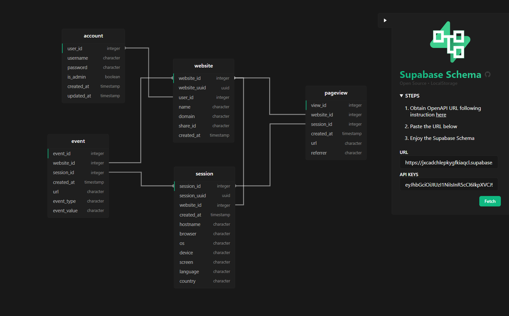

<!-- PROJECT LOGO -->
<br />
<p align="center">
  <a href="https://github.com/zernonia/supabase-schema">
    
  </a>

  <h3 align="center">Supabase Schema</h3>

  <p align="center">
    Secured & Simple <strong><a href="https://supabase.io/">Supabase</a> Schema Visualizer.</strong>
    <br />
    No installations • No Database password required.
    <br />
    <br />
    <a href="https://supabase-schema.vercel.app/">View Demo</a>
    ·
    <a href="https://github.com/zernonia/supabase-schema/issues">Report Bug</a>
    ·
    <a href="https://github.com/zernonia/supabase-schema/issues">Request Feature</a>
  </p>
</p>



## 🚀 Features

- 🔨 No installations
- 🔒 Persistent State in LocalStorage
- 🚪 Login-less
- 👀 No Sensitive info required
- 🤚 Moveable Schema for own design

## 📇 About The Project

I look around the internet and found many Database Schema Visualizers that require me to either download the software, or login to view my Database Schema. I feel like there's too many unneccessary steps, just to view the schema.

Thus, I've decided to take this opportunity to build this **Open Source, Free, Login-less and Secured** Supabase Schema Visualizer 🔥

### 🔨 Built With

- [Vue 3](https://v3.vuejs.org/)
- [Vite](https://vitejs.dev/)
- [WindiCSS](https://windicss.org/)

## 🐾 Instructions

1. Go to [Supabase App](https://app.supabase.io/)
2. Select your Project
3. Go to `Settings`
4. In Settings tab, Go to `API`
5. Under `Config`, copy `URL`
6. Under `API Keys`, copy `anon` `public`
7. Paste both value into their respectively slot in [Supabase Schema](https://supabase-schema.vercel.app/)
8. Fetch data
9. Enjoy the Visualization 🎉

Remeber to ⭐ this repo if you ❤ this Apps

## 🌎 Local Development

### Prerequisites

Yarn

- ```sh
  npm install --global yarn
  ```

### Development

1. Clone the repo
   ```sh
   git clone https://github.com/zernonia/supabase-schema.git
   ```
2. Install NPM packages
   ```sh
   yarn install
   ```
3. Run Development instance
   ```sh
   yarn dev
   ```

## ➕ Contributing

Contributions are what make the open source community such an amazing place to be learn, inspire, and create. Any contributions you make are **greatly appreciated**.

1. Fork the Project
2. Create your Feature Branch (`git checkout -b feature/AmazingFeature`)
3. Commit your Changes (`git commit -m 'Add some AmazingFeature'`)
4. Push to the Branch (`git push origin feature/AmazingFeature`)
5. Open a Pull Request

## 🙏 Acknowledgement

1. Fundamental for this Visualization ([Generate database types from OpenAPI specification](https://supabase.io/docs/reference/javascript/generating-types#generate-database-types-from-openapi-specification))
2. Guide to Construct Dynamic SVG Connector ([Connecting Table using SVG](https://codepen.io/alojzije/pen/ndfrI))
3. [Icones - icon gallery](https://icones.js.org/)

## 📜 License

Distributed under the MIT License. See `LICENSE` for more information.

## 📧 Contact

Zernonia - [@zernonia](https://twitter.com/zernonia) - zernonia@gmail.com
